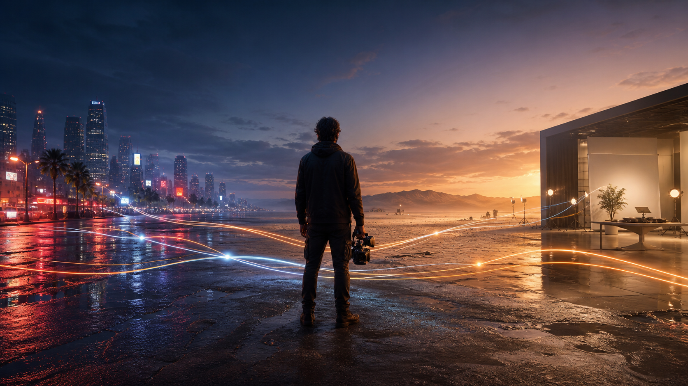

# Awesome Seedance 2.5 Prompts: 72 Video Prompt Recipes in 15 Languages

[](https://seed.bytedance.com/en/seedance2_5)
[](https://flaq.ai/models/bytedance/seedance-2-5-text-to-video/)
[](https://flaq.ai/models/bytedance/seedance-2-5-image-to-video/)
[](LICENSE)

[English](README.md) · [简体中文](README_ZH.md) · [日本語](README_JA.md) · [Español](README_ES.md) · [Français](README_FR.md) · [Deutsch](README_DE.md) · [한국어](README_KO.md) · [Português](README_PT.md) · [Italiano](README_IT.md) · [All 15 languages](prompts/i18n/README.md)



An original, production-oriented library of **72 complete Seedance 2.5 video prompts with support for 15 languages**. Find copy-ready recipes for text-to-video, image-to-video, reference-to-video, synchronized sound, camera direction, green screen, white-model previs, advertising, ecommerce, UGC, education, real estate, mobility, animation, sports, travel, and cinematic storytelling.

## Create with Seedance 2.5 on Flaq AI

[Flaq AI](https://flaq.ai/) brings model discovery, browser-based experimentation, and API-oriented production workflows into one platform. Choose the Seedance 2.5 model from the asset you already have:

| Your starting point | Recommended model | Best use cases |
|---|---|---|
| A concept, script, or shot list | [Seedance 2.5 Text-to-Video](https://flaq.ai/models/bytedance/seedance-2-5-text-to-video/) | Concept films, social hooks, narrative scenes, atmosphere tests, previsualization |
| A product image, portrait, illustration, first frame, or end frame | [Seedance 2.5 Image-to-Video](https://flaq.ai/models/bytedance/seedance-2-5-image-to-video/) | Product ads, identity-preserving portraits, branded assets, artwork animation, controlled transitions |

> Model controls, pricing, duration, resolution, sound, input requirements, and API schemas may change. Check the live Flaq AI pages for current details, and see the [Flaq AI + Seedance 2.5 workflow guide](docs/flaq-ai-api-guide.md) for a transparent integration checklist.

## Find the right prompt in under a minute

| If you need… | Start here |
|---|---|
| One proven prompt to customize | [72-scene master index](prompts/README.md) |
| A product, ad, UGC, or creator-video recipe | [Foundation prompts 04–09](prompts/prompt-library.md) |
| UI, education, real estate, mobility, pet, or industry content | [Extended prompts 37–60](prompts/extended-scenarios.md) |
| SaaS, creator, jewelry, culture, clean-energy, accessibility, or game content | [Advanced English workflows 61–72](prompts/advanced-workflows.en.md) |
| A prompt in your preferred language | [15-language prompt directory](prompts/i18n/README.md) |
| Help choosing by business goal or available asset | [English use-case matrix](docs/use-case-matrix.en.md) |
| Better camera, timing, sound, continuity, or negative constraints | [Advanced prompting guide](docs/prompting-guide.md) |
| A Flaq text-to-video vs image-to-video decision | [Flaq AI model and API workflow](docs/flaq-ai-api-guide.md) |

### What is included

- **72 full recipes**, not one-line prompt fragments: each includes mode, references, timeline, camera, sound, continuity, and exclusions. The core 60-scene catalog is in Simplified Chinese, with 12 additional professional workflows in English.
- **15-language support**, including 14 independent localized prompt files with six complete shared test scenes in each language.
- **20+ practical categories** for brand, ecommerce, UGC, travel, food, fashion, beauty, cinematic, animation, sports, fantasy, VFX, UI, social, education, architecture, mobility, nature, industry, and hospitality workflows.
- **Production guidance** for prompt debugging, aspect-ratio planning, reference ownership, final-frame design, rights review, and iteration records.

## What makes a strong Seedance 2.5 prompt?

The official Seedance 2.5 page highlights video generation up to 30 seconds in one pass, two extensions, more precise interpretation of reference videos, broader audio-visual editing, professional camera movement, performance blocking, white-model control, and green-screen editing. A useful prompt should therefore read like a compact directing brief, not a pile of style adjectives.

```text
[Mode] Text-to-video / Image-to-video / Reference-to-video / Edit
[Goal] Use, audience, emotion, duration, aspect ratio
[Reference roles] Image 1 locks identity; Video 1 provides camera path only
[Visual anchors] Subject, wardrobe, product geometry, set, time, palette
[Timeline] Establishment -> action -> turn -> final frame
[Camera] Shot size, height, path, speed, focus, stopping point
[Performance and physics] Gaze, hands, weight, inertia, contact, cloth, water
[Audio] Dialogue, ambience, foley, music, synchronization cues
[Continuity] What must never change
[Avoid] Morphing, duplicates, extra limbs, fake text, logos, watermarks
```

For the full method, see [Seedance 2.5 Prompting Guide: From Brief to Usable Video](docs/prompting-guide.md).

## Three copy-ready Seedance 2.5 prompts

### Cinematic storm rescue training

```text
Use the input image as the first frame and only visual anchor. Preserve the identities and orange rain gear of the two adult volunteers, the rescue boat geometry, the number of people, the lighthouse position, and the cold storm lighting.

00:00-00:07: Track steadily from water level behind the boat. The hull rises and falls with real weight; spray briefly crosses the lens guard; the lighthouse beam sweeps through rain.
00:07-00:15: Slide forward along the side to the volunteers' shoulders. The front volunteer points toward the safe channel while the rear volunteer adjusts the throttle.
00:15-00:23: A side wave pushes the boat left. Both lower their center of gravity and correct course. Raise the camera slightly to reveal the passage through the rocks; water inertia and body balance must be physically plausible.
00:23-00:30: Enter calmer harbor water. Push past the volunteers toward the lighthouse and stop on a wide, hopeful final frame.

Audio: stereo rain, waves, engine, two short safety calls, and a very soft low string tone at the end. No casualties, added people, altered boat parts, teleporting camera, text, logos, or watermark.
```

### Premium unbranded sparkling-tea ad

```text
Use the bottle in the input image as the only product anchor. Preserve its silhouette, cap, blank-label proportions, amber liquid level, and lighting. Generate no text.

00:00-00:05: Macro focus on condensation, then rack focus to fine bubbles rising in the liquid.
00:05-00:11: Orbit clockwise by about 35 degrees while slowly pulling back. The ice pedestal refracts accurately; two tea leaves travel in the opposite direction for layered motion. The bottle remains stable.
00:11-00:17: A warm backlight passes behind the bottle. The cap lifts only slightly with a clean click and releases a natural mist, not an explosion.
00:17-00:24: Lower to a subtle hero angle. Droplets fall naturally, then stop on a clean front view with negative space above for post-production copy.

Audio: cap click, fine carbonation, light ice sound, minimal fresh rhythm. No fake text, extra bottles, label drift, melting glass, trademarks, or watermark.
```

### Paper fox leaves a sketchbook

```text
Use the input image as the art and character anchor. Preserve the red paper fox's triangular ears, pointed nose, folds, pencil texture, and proportions; preserve the café table, sketchbook, lamp, rainy window, and cup layout.

00:00-00:07: Pencil lines tremble slightly. The fox blinks and raises one front paw as the camera makes a macro push-in.
00:07-00:14: The fox steps over the page edge, transitioning naturally from flat graphite lines to dimensional folded paper with correct contact shadows.
00:14-00:21: Track parallel as it walks around pencil shavings and studies the steam above the cup.
00:21-00:27: Steam forms a brief path toward the rainy window. The fox trots after it while tiny tabletop droplets react to its steps.
00:27-00:30: It stops at the window with a consistent reflection. Raise the camera and finish on an open-ended sense of departure.

Audio: rain, paper folds, wood contact, and minimal glockenspiel. No extra animals, redesign, franchise resemblance, text, logos, or watermark.
```

## Full prompt library

Open the [72-scene master index](prompts/README.md), the [24-scene foundation library](prompts/prompt-library.md), the [36-scene extended library](prompts/extended-scenarios.md), or the [12 advanced English workflows](prompts/advanced-workflows.en.md). Use the [English use-case matrix](docs/use-case-matrix.en.md) to filter by goal and input asset. Together they cover:

- cinematic drama and science fiction;
- product, skincare, beverage, and wearable ads;
- vertical UGC, travel diaries, and food reviews;
- paper craft, clay animation, and living murals;
- climbing, tennis, and street dance;
- jazz, bakery ASMR, and radio drama;
- portrait micro-expressions, architectural parallax, and start/end frames;
- green screen, white-model previs, reference camera paths, and precise editing.
- SaaS launches, creator courses, assembly proof, jewelry, museums, clean energy, telehealth onboarding, podcasts, logistics UI, accessibility, and original game concepts.

### Complete prompt files in more languages

- [English](prompts/i18n/prompt-library.en.md), [Traditional Chinese](prompts/i18n/prompt-library.zh-TW.md), [Japanese](prompts/i18n/prompt-library.ja.md), and [Korean](prompts/i18n/prompt-library.ko.md);
- [Spanish](prompts/i18n/prompt-library.es.md), [French](prompts/i18n/prompt-library.fr.md), [German](prompts/i18n/prompt-library.de.md), and [Brazilian Portuguese](prompts/i18n/prompt-library.pt-BR.md);
- [Arabic](prompts/i18n/prompt-library.ar.md), [Russian](prompts/i18n/prompt-library.ru.md), and [Bahasa Indonesia](prompts/i18n/prompt-library.id.md).
- [Italian](prompts/i18n/prompt-library.it.md), [Thai](prompts/i18n/prompt-library.th.md), and [Vietnamese](prompts/i18n/prompt-library.vi.md).

Each language file contains six complete, copy-ready recipes rather than translated titles alone. See the [localization rules and language matrix](prompts/i18n/README.md).

## Image-to-video checklist

- Lock identity, wardrobe, product shape, object count, composition, and key-light direction.
- Separate subject motion, environmental motion, and camera motion.
- Give each reference file one job; never say “use everything from all references.”
- Describe the camera's start, path, speed, and final stopping point.
- Reserve the final 4–6 seconds for deceleration and a deliberate end frame.
- Add dialogue, ambience, foley, and music as separate audio layers.
- Use original or properly licensed people, music, products, and visual assets.

## Seedance 2.5 prompt FAQ

### What is a Seedance 2.5 prompt?

A Seedance 2.5 prompt is a directing brief for a generated video. Strong prompts define the goal, reference roles, visual anchors, timed actions, camera path, physical behavior, sound, continuity, and concrete failure conditions.

### Should I use Text-to-Video or Image-to-Video?

Use [Text-to-Video](https://flaq.ai/models/bytedance/seedance-2-5-text-to-video/) when you are exploring from a concept or script. Use [Image-to-Video](https://flaq.ai/models/bytedance/seedance-2-5-image-to-video/) when a product, person, illustration, composition, first frame, or end frame must remain recognizable.

### How do I keep a person or product consistent?

Name one primary identity or product anchor, list its invariant properties before describing motion, assign one job to every other reference, and reject redesign, part-count changes, label drift, or identity drift explicitly. Test this anchor before adding elaborate effects.

### Can Seedance 2.5 prompts be written in different languages?

This repository supports 15 languages. The shared multilingual set keeps the same six scene IDs so teams can compare instruction following, UI text, speech, audio, and cultural localization without changing the production brief.

### Are these prompts free to use?

The repository is released under the [MIT License](LICENSE). Generated output may still involve separate rights for source images, people, voices, music, trademarks, locations, claims, and the platform or model used to create it.

## Contributing

New original scenarios, careful localizations, accessibility improvements, and reproducible visual references are welcome. Read [CONTRIBUTING.md](CONTRIBUTING.md) for the prompt format, localization requirements, originality rules, and review checklist.

## Sources and usage

- [Official Seedance 2.5 capability page](https://seed.bytedance.com/en/seedance2_5)
- [Seedance 2.5 Text-to-Video on Flaq AI](https://flaq.ai/models/bytedance/seedance-2-5-text-to-video/)
- [Seedance 2.5 Image-to-Video on Flaq AI](https://flaq.ai/models/bytedance/seedance-2-5-image-to-video/)
- [Official Seedance 2.0 launch notes](https://seed.bytedance.com/en/blog/seedance-2-0-official-launch)

All prompts, scenarios, explanatory copy, and images in this repository were newly created for this collection. The examples avoid celebrity likenesses, third-party brand slogans, and protected fictional characters. Review generated output for copyright, likeness, trademark, audio, safety, and platform-policy compliance before commercial use.

The reproducible visual briefs are documented in [Original Image Prompt Notes](assets/IMAGE_PROMPTS.md).
